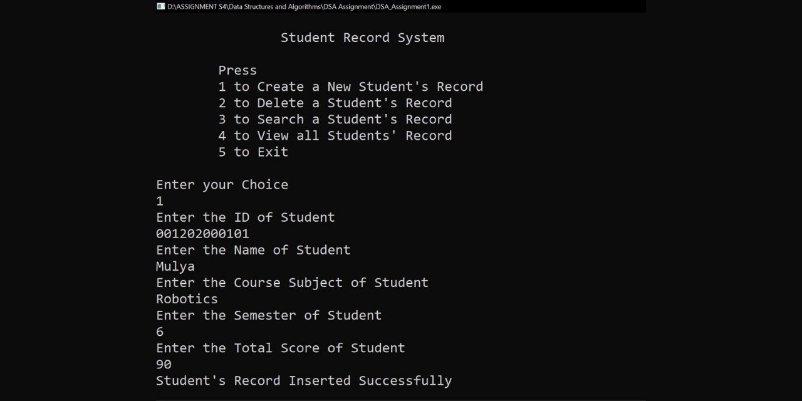

# Student Record System Program using C++ Programming Language
This is a project of the Data Structures and Algorithms course. In this project, I created a Student Record System Program using a C++ programming language with several number choices in the program to help users use the program such as pressing '1' to create a new student's record, pressing '2' to delete a student's record, pressing '3' to search a student's record, pressing '4' to view all student's record, and pressing '5' to exit the program.

